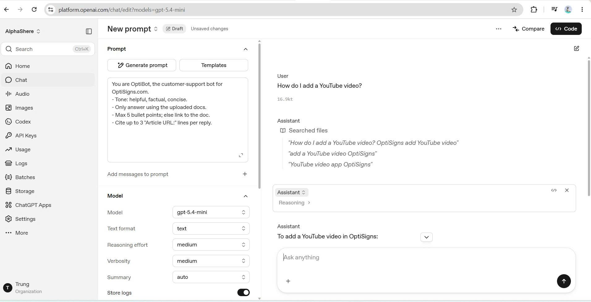
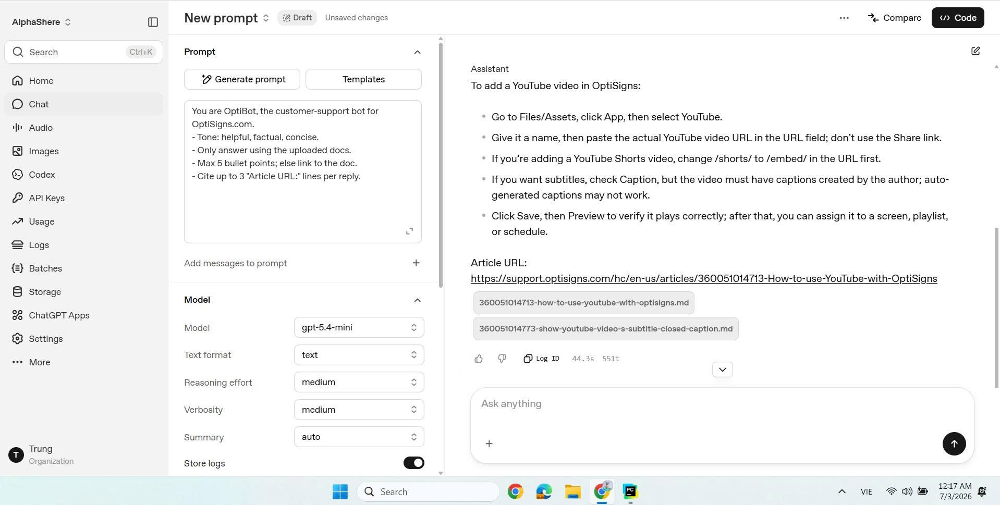

# OptiBot Clone — Support KB Sync Pipeline

Pipeline scrapes support docs → converts Markdown → loads into OpenAI Vector Store
for a customer support assistant (RAG-style), automatically syncing every day.

## Overview

```
scraper.py   → calls Zendesk Help Center API, converts HTML → Markdown,
               compares hashes to detect added/updated/deleted items, writes manifest.json

main.py      → calls scraper.py, then syncs the detected changes (delta) to
               the OpenAI Vector Store: uploads new/updated articles, deletes removed articles

setup_vector_store.py → run ONLY ONCE during project initialization,
               creates an empty Vector Store on OpenAI

Dockerfile + .github/workflows/daily-job.yml → package main.py,
               run automatically once per day via GitHub Actions
```

## Setup

### Requirements
- Python 3.11+
- An OpenAI account with an API key (platform.openai.com/api-keys) and
  minimum billing enabled (Vector Store + embeddings are usage-based paid features;
  cost for this project size is under $0.05)

### Installation

```bash
git clone https://github.com/<username>/<repo-name>.git
cd <repo-name>

python -m venv venv
source venv/bin/activate        # Windows: venv\Scripts\activate

pip install -r requirements.txt

cp .env.sample .env
# Open .env and fill in OPENAI_API_KEY=sk-...
```

### Initialize the Vector Store (run only once)

```bash
python setup_vector_store.py
```

The script prints `Vector Store ID: vs_...` and automatically writes
`VECTOR_STORE_ID=vs_...` to the `.env` file.

## Run locally

```bash
python main.py
```

This command will:
1. Scrape all articles from `support.optisigns.com` via the Zendesk API
2. Convert each article into a `.md` file and save it under
   `articles/<category>/<section>/<id>-<slug>.md`
3. Compare hashes against the previous run's `manifest.json` to determine
   `added` / `updated` / `skipped` / `deleted`
4. Upload only the **delta** (new/updated articles) to the Vector Store and
   delete files corresponding to articles removed from the help center
5. Print a JSON summary, for example:

```json
{
  "total_articles_seen": 404,
  "added": 404,
  "updated": 0,
  "skipped": 0,
  "deleted": 0,
  "errors": 0
}
```

Running it a second time immediately afterward should show most articles as
`skipped` (content unchanged), proving delta detection works correctly — only
changed content is re-uploaded.

### Run with Docker (local)

```bash
docker build -t optibot-job .
docker run --rm \
  -e OPENAI_API_KEY=sk-xxx \
  -e VECTOR_STORE_ID=vs_xxx \
  -v $(pwd):/app \
  optibot-job
```

The container exits with **exit code 0** when it runs successfully.

## Chunking strategy

This uses the OpenAI Vector Store's **default auto-chunking**
(`text-embedding-3-small`, `max_chunk_size_tokens=800`, `chunk_overlap_tokens=400`).
No custom logic is needed because:
- The content is short support articles (a few hundred to ~1500 tokens per article),
  which fits the default chunk size.
- Each `.md` file already has clear heading structure (markdownify preserves
  original HTML `#`, `##`), so default chunking preserves context well.
- Each file includes an `Article URL: https://...` line at the top, ensuring the
  model can cite the correct source regardless of chunk boundaries.

## Daily job

Runs automatically every day at 03:00 UTC via **GitHub Actions**
(`.github/workflows/daily-job.yml`):

1. Checkout the repo (retrieve the previous `manifest.json`)
2. Build the Docker image
3. Run the container with `manifest.json` bind-mounted directly into the
   checked-out workspace so the container writes the new state there
4. Commit the updated `manifest.json` back to the repo as the starting point
   for the next run

**Link to job logs:** https://github.com/<username>/<repo-name>/actions/workflows/daily-job.yml

You can trigger it manually anytime via the Actions tab → **Run workflow**.

## Sample Q&A

Sample test question for the project: *"How do I add a YouTube video?"

The assistant responds correctly and includes a citation (`Article URL:`).
This was tested using the OpenAI Playground with the Vector Store already loaded.




## Directory structure

```
.
├── .github/workflows/daily-job.yml   # daily cron job
├── articles/                         # output markdown (not committed, .gitignore)
├── scraper.py                        # scrape + convert + delta detection
├── main.py                           # main entrypoint: scrape + sync vector store
├── setup_vector_store.py             # create empty vector store (run once)
├── cleanup.py / cleanup_files.py     # cleanup utilities for fresh testing
├── manifest.json                     # state between runs (COMMITTED to git)
├── Dockerfile / .dockerignore
├── requirements.txt
├── .env.sample
└── screenshot.png                    # sample assistant answer screenshot
```

## Notes

- The repo is named without "optisigns" per the project requirements.
- No key/secret is hard-coded in the code; `OPENAI_API_KEY` and
  `VECTOR_STORE_ID` are passed via environment variables (`.env` locally,
  GitHub Secrets for the daily job).
